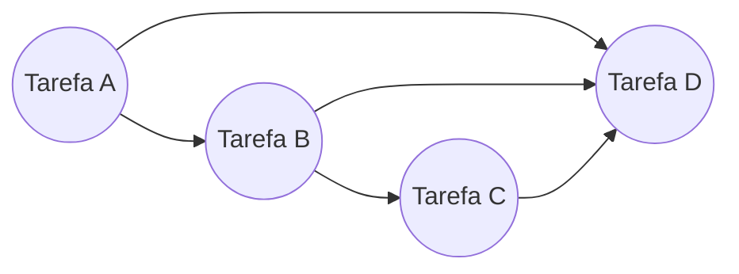
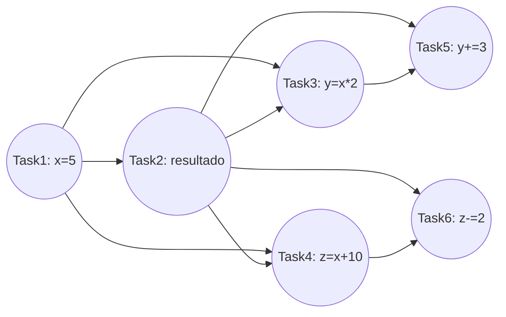

# Segunda Lista de Exercícios — Programação Concorrente
**Prof. Gabriel P. Silva — 2026.1**

---

## 1) Diferenças entre valor retornado dentro e fora de uma região paralela (0,5 ponto)

**a) `omp_get_num_threads()`**
- **Fora** de uma região paralela: retorna **1**, pois o "time" (team) de threads ativo é composto apenas pela thread mestre.
- **Dentro** de uma região paralela: retorna o número de threads que compõem o time atual (o tamanho real do time criado por aquele `#pragma omp parallel`).

**b) `omp_get_max_threads()`**
- Retorna o **mesmo valor dentro e fora** da região paralela: o número máximo de threads que *seriam* usadas caso uma região paralela sem `num_threads` fosse encontrada nesse ponto (valor definido por `omp_set_num_threads()` ou pela variável de ambiente `OMP_NUM_THREADS`). Não depende do contexto de execução.

**c) `omp_get_num_procs()`**
- Retorna o número de processadores/núcleos físicos disponíveis na máquina. Também é **igual dentro e fora** — é uma propriedade do hardware, não do estado de execução do programa.

**d) `omp_in_parallel()`**
- **Fora**: retorna `false` (0).
- **Dentro** de uma região paralela ativa: retorna `true` (valor diferente de 0). É justamente a função usada para checar se o código está sendo executado dentro de uma região paralela.

---

## 2) Diferenças entre `private`, `firstprivate` e `lastprivate` (0,5 ponto)

| Cláusula | Valor inicial dentro do bloco | Valor após o bloco |
|---|---|---|
| `private` | **Indefinido** (não herda valor da variável original) | Descartado — variável original não é alterada |
| `firstprivate` | Inicializado com o valor da variável **antes** de entrar no bloco | Descartado |
| `lastprivate` | Indefinido (como `private`) | A variável original recebe o valor da **última iteração** (sequencialmente) do laço (ou última seção) |

**Onde são usadas:**
- `private` e `firstprivate`: podem ser usadas em `parallel`, `for`, `sections` e `single`.
- `lastprivate`: usada apenas em `for` e `sections` (não tem sentido em `single`, pois lá existe apenas uma única execução/thread, não há "última iteração").

---

## 3) Diferenças entre `master` e `single` (0,5 ponto)

- **`master`**: o bloco é executado **apenas pela thread mestre** (thread 0) do time. **Não há barreira implícita** nem antes nem depois — as outras threads simplesmente pulam o bloco e seguem adiante.
- **`single`**: o bloco é executado por **uma única thread qualquer** do time (não necessariamente a mestre — a primeira que chegar ali). Existe uma **barreira implícita ao final** do bloco (todas as outras threads esperam a thread que executou o `single` terminar), a menos que se use a cláusula `nowait`.

---

## 4) Exemplo de `reduction` no OpenMP (0,5 ponto)

```c
double sum = 0.0;
#pragma omp parallel for reduction(+:sum)
for (int i = 0; i < n; i++) {
    sum += a[i];
}
```

Cada thread mantém uma cópia privada de `sum`, inicializada com o elemento neutro da operação (0 para `+`), acumula localmente, e ao final o runtime combina (reduz) todas as cópias parciais na variável compartilhada.

**Quatro operações de redução possíveis:**
1. `+` (soma)
2. `*` (produto)
3. `max` (máximo)
4. `min` (mínimo)

*(outras também válidas: `-`, `&&`, `||`, `&`, `|`, `^`)*

---

## 5) Diagrama de escalonamento — `schedule(guided, 5)`, 50 iterações, 4 threads (0,5 ponto)

```c
#pragma omp for schedule(guided, 5)
for (j = 0; j < 50; j++)
    a[j] = b[j] + c[j];
```

No escalonamento **guided**, o tamanho do bloco (chunk) entregue a cada thread que solicita trabalho começa **grande** e **decresce exponencialmente** (aproximadamente `iterações_restantes / nº_threads`) até atingir o tamanho mínimo especificado (aqui, **5**), tamanho no qual permanece até o fim.

Simulando o decaimento (chunk ≈ ⌈restantes / 4⌉, mínimo 5):

| Chunk | Iterações (j) | Tamanho | Thread (exemplo) |
|---|---|---|---|
| 1 | 0 – 12 | 13 | T0 |
| 2 | 13 – 22 | 10 | T1 |
| 3 | 23 – 29 | 7 | T2 |
| 4 | 30 – 34 | 5 | T3 |
| 5 | 35 – 39 | 5 | T0 |
| 6 | 40 – 44 | 5 | T1 |
| 7 | 45 – 49 | 5 | T2 |

```
T0: [0..12]            [35..39]
T1:         [13..22]            [40..44]
T2:                  [23..29]            [45..49]
T3:                            [30..34]
```

> **Observação importante:** o tamanho dos blocos decrescentes é determinístico (depende do algoritmo guided da implementação), mas **qual thread física recebe cada chunk não é** — depende de qual thread fica livre e solicita trabalho primeiro em tempo de execução. O diagrama acima é apenas um exemplo plausível de atribuição.

---

## 6) Inserindo `barrier` explícitas para maximizar desempenho (0,5 ponto)

Analisando as dependências entre os três laços:
- **Laço 1** (`a[j] = b[j]+c[j]`) e **Laço 2** (`d[j] = e[j]*f`) são totalmente independentes entre si — não compartilham nenhum dado. Podem continuar com `nowait`.
- **Laço 3** (`z[j] = (a[j]+a[j+1])*0.5`) **depende de todo o vetor `a[]`** estar completamente calculado (inclusive `a[j+1]`, que pode ter sido calculado por outra thread). Por isso, é necessária uma barreira **antes do Laço 3**, garantindo que o Laço 1 tenha terminado completamente em todas as threads.

```c
#pragma omp parallel
{
    #pragma omp for nowait
    for (j = 0; j < n; j++)
        a[j] = b[j] + c[j];

    #pragma omp for nowait
    for (j = 0; j < n; j++)
        d[j] = e[j] * f;

    #pragma omp barrier   // necessária: Laço 3 depende de a[] completo

    #pragma omp for nowait
    for (j = 0; j < n; j++)
        z[j] = (a[j] + a[j+1]) * 0.5;
}
```

O `nowait` no laço 3 pode ser mantido pois nada após ele depende de `z[]` dentro da região paralela (e existe a barreira implícita ao final do `parallel`).

---

## 7) Paralelização sem `for`/`parallel for` (0,5 ponto)

```c
for (i = 0; i < n; i++)
    z[i] = a * x[i] + y;
```

Usando apenas `#pragma omp parallel` e divisão manual do espaço de iteração com `omp_get_thread_num()`:

```c
#pragma omp parallel
{
    int id = omp_get_thread_num();
    int nthreads = omp_get_num_threads();

    int chunk = (n + nthreads - 1) / nthreads;  // arredonda para cima
    int inicio = id * chunk;
    int fim = (inicio + chunk < n) ? inicio + chunk : n;

    for (int i = inicio; i < fim; i++)
        z[i] = a * x[i] + y;
}
```

---

## 8) Pode ou não pode paralelizar com `parallel for`? (0,5 ponto)

**a)**
```c
for (i = 0; i < N; i++)
    if (x[i] > maxval) break;
```
**Não pode.** Contém um `break`, cuja semântica de "saída antecipada" depende estritamente da ordem sequencial de varredura. O OpenMP nem permite `break` dentro de um `#pragma omp for` (erro de compilação) — a verificação de parada e a iteração em que ela ocorre seriam não-determinísticas em paralelo.

**b)**
```c
for (i = 0; i < N; i++)
    for (j = 0; j < i; j++)
        a[j][i] = a[j+1][i];
```
- **Laço interno (j):** **não pode** ser paralelizado — há uma **anti-dependência (WAR)**: a iteração `j` lê `a[j+1][i]`, valor que é **escrito** pela iteração `j+1` do mesmo laço. Em ordem sequencial isso é seguro (a leitura sempre ocorre antes da escrita correspondente), mas em paralelo a ordem não é garantida.
- **Laço externo (i):** **pode** ser paralelizado — cada coluna `i` é tratada de forma totalmente independente das demais colunas.

**c)**
```c
for (k = 0; k < N; k++)
    x[k] = q + y[k]*(r*z[k+10] + t*z[k+11]);
```
**Pode.** Cada iteração apenas lê elementos de `y` e `z` (sem que nenhuma iteração escreva nesses arrays) e escreve em `x[k]`, posição exclusiva daquela iteração. Não há dependência entre iterações.

**d)**
```c
for (i = 1; i < N; i++)
    x[i] = z[i]*(y[i] - x[i-1]);
```
**Não pode.** Há uma **recorrência verdadeira (RAW)**: `x[i]` depende de `x[i-1]`, calculado na iteração imediatamente anterior. É uma dependência sequencial genuína — não removível com cláusulas simples (exigiria reformulação algorítmica, ex.: técnicas de *parallel scan/prefix*).

**e)**
```c
for (i = 0; i < N; i++) {
    a[i] = a[i]*a[i];
    if (fabs(a[i]) > machine_max || fabs(a[i]) < machine_min) {
        printf("i = %d \n", i);
        break;
    }
}
```
**Não pode**, pelo mesmo motivo do item (a): contém `break`, com semântica dependente da ordem sequencial de execução (qual `i` é "o primeiro" a violar a condição).

**f)**
```c
for (i = 1; i < N; i++)
    for (k = 0; k < i; k++)
        w[i] += b[k][i] * w[(i-k)-1];
```
- **Laço externo (i): não pode.** `w[i]` é calculado usando vários `w[i']` com `i' < i` — uma recorrência que exige que todos os valores anteriores de `w` já estejam definidos.
- **Laço interno (k), para um `i` fixo:** poderia, em princípio, ser tratado como uma **redução** sobre `w[i]` (soma de produtos), mas só depois que todos os `w` anteriores (de iterações externas anteriores) já estiverem prontos — ou seja, não resolve a dependência externa, apenas paraleliza um acúmulo já interno e sequencial por natureza.

**g)**
```c
for (k = 0; k < N; k++)
    x[k] = u[k] + r*(z[k] + r*y[k]) +
           t*(u[k+3] + r*(u[k+2] + r*u[k+1]) +
              t*(u[k+6] + r*(u[k+5] + r*u[k+4])));
```
**Pode.** Apesar da expressão extensa, cada iteração apenas **lê** uma janela de `u` (`u[k]` até `u[k+6]`), `y[k]` e `z[k]`, e escreve exclusivamente em `x[k]`. Nenhum array lido é modificado por nenhuma iteração — é um padrão tipo *stencil* sem dependências entre iterações.

---

## 9) Laço com `x` `firstprivate` (0,5 ponto)

```c
x = 1;
#pragma omp parallel for firstprivate(x)
for (i = 0; i < N; i++) {
    y[i] = x + i;
    x = i;
}
```

**a) Por que está incorreto?**
O cálculo de `y[i]` depende do valor de `x` deixado pela iteração **lógica anterior** (`x = i` da iteração `i-1`) — é uma recorrência sequencial. Como `x` é `firstprivate`, **cada thread** recebe sua **própria cópia**, inicializada com `x = 1` (valor de antes do laço). Dentro de cada thread, a atualização `x = i` só fica visível para as iterações subsequentes processadas *pela mesma thread* — não é compartilhada com as demais. Por isso, **`y[i]` não terá o mesmo resultado** independentemente do número de threads: o valor depende de qual thread executa cada iteração e de quantas iterações cada uma processa antes daquele ponto. O resultado correto sequencial seria `y[0] = 1` e `y[i] = 2i - 1` para `i ≥ 1`; em paralelo, threads diferentes do início de cada chunk vão calcular `y[i] = 1 + i` (usando a cópia inicial `x=1`) em vez do valor correto.

**b) Valores finais de `i` e `x`:**
- `i`: ao final do laço, a variável de controle assume o valor que teria ao término de uma execução sequencial equivalente, ou seja, **`i = N`**.
- `x`: como é `firstprivate` (e não `lastprivate`), a cópia de cada thread é **descartada** ao final do laço — a variável original **não é atualizada**, permanecendo com o valor anterior ao laço: **`x = 1`**.

**c) Se `x` fosse `shared`:**
Todas as threads acessariam e modificariam a **mesma** variável `x` simultaneamente, configurando uma **condição de corrida**. O valor final de `x` seria **indeterminado** — dependeria de qual thread fosse a última a escrever nela antes do término do laço (provavelmente próximo de `N-1`, mas sem garantia, devido à ausência de sincronização).

**d) É possível paralelizar corretamente apenas com diretivas OpenMP?**
Não, **não apenas adicionando cláusulas**: existe uma dependência de dados real entre iterações (recorrência). Para paralelizar corretamente preservando a semântica, é preciso **reescrever o algoritmo** eliminando a dependência — percebendo que o "valor antigo de x" usado em `y[i]` é simplesmente `i-1` (para `i ≥ 1`) ou `1` (para `i = 0`):

```c
#pragma omp parallel for
for (i = 0; i < N; i++) {
    y[i] = (i == 0) ? 1 : (i - 1) + i;
}
```

---

## 10) Mecanismos do OpenMP para condições de corrida (0,5 ponto)

- **`#pragma omp critical`** — seção crítica: apenas uma thread por vez executa o bloco.
- **`#pragma omp atomic`** — operação atômica de baixo custo para atualizações simples (ex.: `x += y`).
- **Cláusula `reduction`** — evita a corrida ao manter acumuladores privados combinados ao final.
- **Locks explícitos** (`omp_lock_t`, `omp_set_lock`, `omp_unset_lock`, `omp_init_lock`) — controle manual e mais flexível de exclusão mútua.
- **Cláusulas `private`/`firstprivate`/`lastprivate`** — evitam compartilhamento indevido de variáveis que não deveriam ser globais ao time.
- **`#pragma omp barrier`** — sincroniza pontos de execução entre threads.
- **`single`/`master`** — restringem trechos críticos a uma única thread.
- **`ordered`** — preserva a ordem sequencial quando necessário.

---

## 11) Diretiva `ordered` (0,5 ponto)

A diretiva `ordered` garante que uma seção específica do corpo de um laço paralelo seja executada **na mesma ordem sequencial** das iterações originais, mesmo que o laço como um todo esteja sendo executado em paralelo (e fora de ordem). É necessária a cláusula `ordered` no `#pragma omp for`, e o trecho a ser ordenado é demarcado com `#pragma omp ordered`.

```c
#pragma omp parallel for ordered
for (int i = 0; i < N; i++) {
    int resultado = computa_pesado(i);   // pode executar fora de ordem, em paralelo

    #pragma omp ordered
    {
        printf("Resultado %d: %d\n", i, resultado);  // sempre impresso na ordem 0,1,2,...
    }
}
```

---

## 12) Cláusula `collapse` (0,5 ponto)

`collapse(n)` combina **n laços perfeitamente aninhados** em um único espaço de iteração lógico, permitindo que o runtime distribua as iterações combinadas entre as threads de forma mais granular.

```c
#pragma omp parallel for collapse(2)
for (i = 0; i < N; i++)
    for (j = 0; j < M; j++)
        a[i][j] = b[i][j] + c[i][j];
```

**Quando usar:**
- Quando o laço **mais externo** tem **poucas iterações** (menor que o número de threads disponíveis), causando desbalanceamento de carga — combinando com os laços internos, há trabalho suficiente para distribuir bem entre todas as threads.
- Exige que os laços sejam **perfeitamente aninhados** (sem código entre as diretivas `for`, e os limites do laço interno podem depender de variáveis dos laços externos, mas a forma do laço deve ser canônica).

---

## 13) Tarefas explícitas vs. implícitas (0,5 ponto)

- **Tarefa implícita:** gerada **automaticamente** pelo runtime ao encontrar `#pragma omp parallel`. Cada thread do time recebe uma tarefa implícita correspondente ao bloco da região paralela.
- **Tarefa explícita:** criada **manualmente** pelo programador com `#pragma omp task`. Uma nova tarefa explícita é gerada cada vez que essa diretiva é encontrada em tempo de execução — tipicamente dentro de um `single` ou `master`, para que apenas uma thread gere as tarefas (evitando duplicação).

**Contextos de geração:**
- Implícitas: ao entrar em qualquer região `parallel`.
- Explícitas: ao encontrar a diretiva `task`, executada pela thread que a alcançar.

---

## 14) Ponto de escalonamento de tarefas (0,5 ponto)

Um **ponto de escalonamento de tarefas** (*task scheduling point*) é um momento da execução em que uma thread pode **suspender** a tarefa que está executando e decidir executar outra tarefa do pool de tarefas pendentes, em vez de continuar imediatamente.

**Ações possíveis ao encontrar um ponto de escalonamento:**
1. **Começar a execução** de uma nova tarefa-filha recém-criada.
2. **Suspender** a tarefa atual e iniciar/retomar **outra** tarefa já disponível na fila.
3. **Retomar** uma tarefa suspensa anteriormente.
4. **Continuar** a execução da tarefa atual sem trocar, caso não haja outra tarefa elegível.

*(Pontos de escalonamento ocorrem, por exemplo: na criação de uma tarefa, ao final de uma tarefa, em `taskwait`, `taskyield`, ao final de uma região `taskgroup`, e em barreiras.)*

---

## 15) Pontos de sincronização de tarefas e `taskwait` (0,5 ponto)

**Pontos de sincronização de tarefas** são locais no código em que se garante que determinadas tarefas tenham **completado sua execução** antes que o fluxo do programa possa continuar — servem para coordenar a conclusão de tarefas geradas anteriormente.

A diretiva **`#pragma omp taskwait`** é especificamente um ponto de sincronização que faz a tarefa atual (a "pai") **esperar** até que **todas as suas tarefas-filhas diretas** (criadas antes do `taskwait`, dentro do escopo atual) tenham terminado, antes de seguir adiante. É importante notar que o `taskwait` espera apenas as filhas *diretas*, não os "netos" (tarefas criadas pelas filhas), e — diferente de uma barreira — não sincroniza todas as threads do time, apenas as tarefas relacionadas à tarefa atual.

---

## 16) Pontos de escalonamento e sincronização no código (1,0 ponto)

```c
#pragma omp parallel num_threads(4)
{
    #pragma omp single
    {
        #pragma omp task                      // (1) ESCALONAMENTO: criação da Tarefa A
        printf("Executando Tarefa A \n");

        #pragma omp taskyield                 // (2) ESCALONAMENTO explícito
        printf("Após taskyield \n");

        #pragma omp task                      // (3) ESCALONAMENTO: criação da Tarefa B
        printf("Executando Tarefa B \n");

        #pragma omp taskwait                  // (4) SINCRONIZAÇÃO: espera A e B
        printf("Após taskwait \n");

        int data = 0;
        #pragma omp task depend(out: data)    // (5) ESCALONAMENTO: criação da Tarefa C
        data = 42;

        #pragma omp task depend(in: data)     // (6) ESCALONAMENTO: criação da Tarefa D
        printf("Data = %d\n", data);          //     (depende de C via 'data' — dependência de dados)

        #pragma omp taskgroup                 // abre região de agrupamento
        {
            #pragma omp task                  // (7) ESCALONAMENTO: criação da Tarefa E
            printf("Tarefa E no taskgroup \n");

            #pragma omp task                  // (8) ESCALONAMENTO: criação da Tarefa F
            printf("Tarefa F no taskgroup \n");
        } // (9) SINCRONIZAÇÃO: fim do taskgroup — espera E e F (e quaisquer descendentes)

    } // (10) SINCRONIZAÇÃO: barreira implícita do single
      //      (também garante a conclusão de C e D, criadas antes deste ponto)
} // (11) SINCRONIZAÇÃO: barreira implícita do final do parallel
```

**Resumo:**
- **Pontos de escalonamento:** criação de cada tarefa (A, B, C, D, E, F) e o `taskyield` explícito.
- **Pontos de sincronização:** o `taskwait` (espera A e B); o fim do `taskgroup` (espera E e F); a barreira implícita ao final do `single`; e a barreira implícita ao final da região `parallel`.
- A relação entre C e D não é um "ponto de sincronização" clássico, mas uma **dependência de dados** (`depend(out:data)` → `depend(in:data)`): D só pode começar depois que C terminar de escrever em `data`.

---

## 17) Cláusulas `if` e `final` (0,5 ponto)

**`if(condição)`** — controla se a **própria tarefa** será criada como uma tarefa adiada (deferred, podendo ser executada por qualquer thread, de forma assíncrona) ou executada **imediatamente** ("undeferred") pela própria thread que a encontrou, de forma síncrona — quando a condição é falsa.

```c
#pragma omp task if(n > 1000)
processa(n);
```

**`final(condição)`** — quando verdadeira, marca a tarefa atual como **final**: todas as tarefas **descendentes** geradas dentro dela (mesmo possuindo sua própria diretiva `task`) passam a ser tratadas como tarefas *"included"* — executadas imediatamente e in-line, **independentemente das próprias cláusulas `if`** dessas tarefas-filhas. É muito usada para limitar a profundidade de recursão em algoritmos recursivos baseados em tarefas, reduzindo overhead de criação de tarefas muito pequenas.

```c
void fib_task(int n, int *res, int depth) {
    #pragma omp task final(depth > 15) shared(res)
    {
        ...
    }
}
```

**Diferença fundamental:** `if` decide o comportamento **da própria tarefa**; `final` decide o comportamento de **toda a subárvore de tarefas descendentes**.

---

## 18) Cláusula `depend` e grafo de dependências (0,5 ponto)

```c
int A = 0, B = 0, C = 0;
#pragma omp parallel
{
    #pragma omp single
    {
        #pragma omp task depend(out: A)               // Tarefa A
        A = 1;

        #pragma omp task depend(in: A) depend(out: B) // Tarefa B
        B = A + 1;

        #pragma omp task depend(in: B) depend(inout: C) // Tarefa C
        C = B + C;

        #pragma omp task depend(in: A, B, C)           // Tarefa D
        printf("Resultado final %d %d %d \n", A, B, C);
    }
}
```

**Grafo de dependências:**



- A → B (B lê `A`, que A escreveu)
- B → C (C lê `B`)
- A, B, C → D (D lê todas as três no `printf`)

---

## 19) Grafo de dependências (1,0 ponto)

```c
// Task 1: depend(out: x)            -> x = 5;
// Task 2: depend(in: x, y, z)       -> resultado = x + y + z;
// Task 3: depend(in: x) depend(out: y) -> y = x * 2;
// Task 4: depend(in: x) depend(out: z) -> z = x + 10;
// Task 5: depend(inout: y)          -> y = y + 3;
// Task 6: depend(inout: z)          -> z = z - 2;
```

> Importante: no OpenMP, a cláusula `depend` cria dependências **apenas com tarefas-irmãs criadas anteriormente** (ordem de geração no programa). Como a Task 2 é criada **antes** das Tasks 3 e 4, ela lê os valores **originais** de `y` e `z` (0), e ainda assim cria uma **dependência anti (WAR)** sobre as tarefas posteriores que escrevem essas mesmas variáveis — garantindo que elas não sejam sobrescritas antes da leitura de Task 2.

**Arestas do grafo (produtor → consumidor/conflito, em ordem de criação):**

| Origem | Destino | Motivo |
|---|---|---|
| 1 | 2 | Task1 escreve `x`; Task2 lê `x` |
| 1 | 3 | Task1 escreve `x`; Task3 lê `x` |
| 1 | 4 | Task1 escreve `x`; Task4 lê `x` |
| 2 | 3 | Task2 lê `y`; Task3 escreve `y` (anti-dependência) |
| 2 | 4 | Task2 lê `z`; Task4 escreve `z` (anti-dependência) |
| 2 | 5 | Task2 lê `y`; Task5 escreve `y` (anti-dependência) |
| 2 | 6 | Task2 lê `z`; Task6 escreve `z` (anti-dependência) |
| 3 | 5 | Task3 escreve `y`; Task5 lê/escreve `y` |
| 4 | 6 | Task4 escreve `z`; Task6 lê/escreve `z` |



---

## 20) Diretiva `taskloop` (0,5 ponto)

`#pragma omp taskloop` paraleliza um laço dividindo suas iterações em **blocos**, onde **cada bloco é gerado como uma tarefa explícita** (em vez de usar o mecanismo de work-sharing tradicional do `#pragma omp for`). É especialmente útil para combinar paralelismo baseado em laços com a flexibilidade do modelo de tarefas — por exemplo, dentro de algoritmos recursivos, ou quando se deseja usar `depend`/`taskgroup` sobre os blocos do laço.

```c
#pragma omp parallel
#pragma omp single
#pragma omp taskloop grainsize(100)
for (i = 0; i < N; i++)
    processa(i);
```

**Duas cláusulas específicas:**
- **`grainsize(n)`**: especifica o número *aproximado* de iterações que cada tarefa gerada deve conter — o runtime decide quantas tarefas criar, mantendo cada uma com cerca de `n` iterações.
- **`num_tasks(n)`**: especifica diretamente o **número de tarefas** a serem criadas — as iterações são divididas entre essas `n` tarefas (controle inverso ao de `grainsize`).

*(Cláusula adicional útil: `nogroup` — remove o `taskgroup` implícito ao final do `taskloop`, permitindo sincronização externa customizada.)*

---

*Documento gerado a partir de "Segunda_Lista_de_Exercícios_ProgConc.pdf"*
